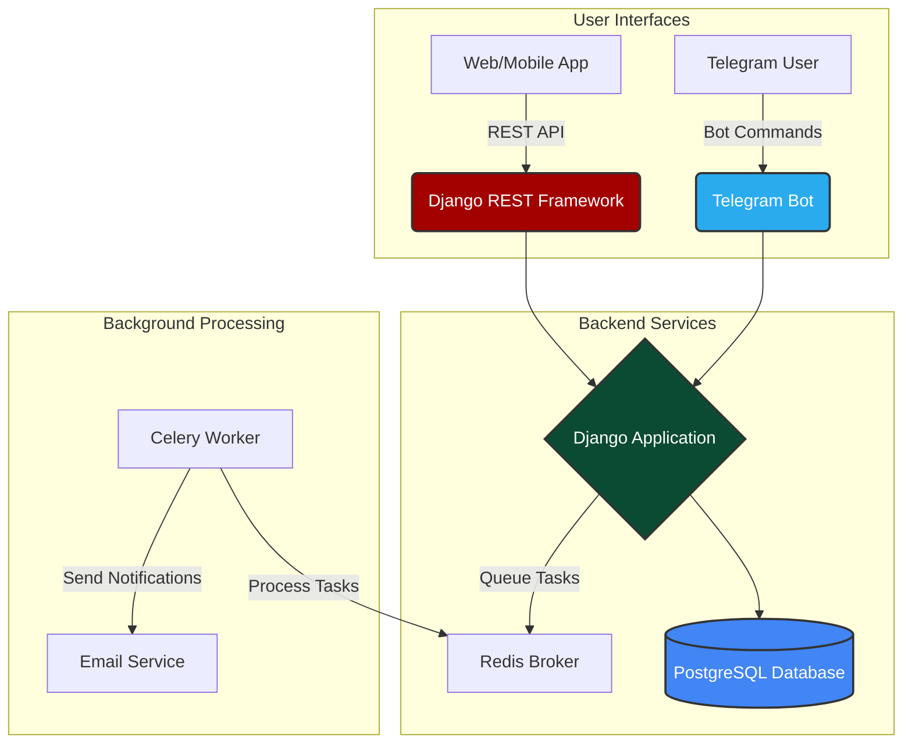

<div align="center">

# 🚀 Feedback Collection System


**A modern, production-ready feedback collection system built with Django and Celery**

*Collect feedback seamlessly via REST API or Telegram Bot with asynchronous processing*

<!-- 🎬 PROJECT DEMO - Replace with your actual demo GIF/video -->


</div>

---

## 📋 Table of Contents

- [🎯 About](#about)
- [✨ Features](#features)
- [🏗️ Architecture](#architecture)
- [🛠️ Tech Stack](#tech-stack)
- [🚀 Quick Start](#quick-start)
- [⚙️ Configuration](#configuration)
- [🔌 API Documentation](#api-documentation)
- [🤖 Telegram Bot](#telegram-bot)
- [🐳 Docker Deployment](#docker-deployment)
- [🤝 Contributing](#contributing)
- [📄 License](#license)

---

## 🎯 About

This feedback collection system solves the common problem of slow, synchronous feedback forms. By leveraging **Celery** and **Redis** for asynchronous processing, your application stays fast and responsive while handling feedback submissions and notifications in the background.

<div align="center">

<p><em>Clean and intuitive Django Admin interface for managing feedback</em></p>
</div>

### Why This System?

- **🚀 Non-blocking**: Feedback processing happens asynchronously
- **🔄 Dual Channels**: REST API + Telegram Bot integration
- **🛡️ Secure**: JWT authentication and environment-based configuration
- **📊 Manageable**: Built-in Django Admin for easy management
- **🐳 Deployable**: Docker-ready for consistent deployments

---

## ✨ Features

| Feature | Description |
|---------|-------------|
| **🔐 JWT Authentication** | Secure API endpoints with JSON Web Tokens |
| **⚡ Async Processing** | Background email notifications via Celery |
| **🤖 Telegram Integration** | Interactive bot for conversational feedback |
| **📝 Dual Input Methods** | REST API and Telegram Bot channels |
| **🖥️ Admin Interface** | Centralized management through Django Admin |
| **🛡️ Security First** | Environment variables for sensitive data |
| **🐳 Container Ready** | Docker and Docker Compose included |

---

## 🏗️ Architecture



---

## 🛠️ Tech Stack

<table>
<tr>
<td valign="top" width="33%">

**Backend**
- Django 4.2.2
- Django REST Framework 3.14.0
- PostgreSQL
- JWT Authentication

</td>
<td valign="top" width="33%">

**Async Processing**
- Celery 5.3.1
- Redis 4.5.5
- Background Tasks
- Email Notifications

</td>
<td valign="top" width="33%">

**Integration**
- Telegram Bot API 20.3
- Docker & Docker Compose
- Environment Configuration

</td>
</tr>
</table>

---

## 🚀 Quick Start

### Prerequisites

Ensure you have these installed:

```bash
Python 3.8+
Git
Redis Server
PostgreSQL (optional with Docker)
```

### 1️⃣ Clone and Setup

```bash
# Clone the repository
git clone https://github.com/Tushar8982/Feedback_system.git
cd Feedback_system

# Create virtual environment
python -m venv venv

# Activate virtual environment
# Windows:
.\venv\Scripts\activate
# macOS/Linux:
source venv/bin/activate

# Install dependencies
pip install -r requirements.txt
```

### 2️⃣ Configure Environment

```bash
# Copy environment template
cp .env.example .env

# Edit .env with your configurations
# (See Configuration section below)
```

### 3️⃣ Database Setup

```bash
# Apply migrations
python manage.py makemigrations
python manage.py migrate

# Create superuser
python manage.py createsuperuser
```

### 4️⃣ Run the Application

You need **3 terminals** running simultaneously:

**Terminal 1 - Redis Server:**
```bash
redis-server
```

**Terminal 2 - Celery Worker:**
```bash
celery -A feedback_system worker -l info
```

**Terminal 3 - Django Server:**
```bash
python manage.py runserver
```

🎉 **Access your application at:** `http://127.0.0.1:8000`

---

## ⚙️ Configuration

Create a `.env` file with these variables:

```env
# Django Settings
SECRET_KEY=your-super-secret-key-here
DEBUG=True

# Database Configuration
DB_NAME=feedbackdb
DB_USER=postgres
DB_PASSWORD=your_db_password
DB_HOST=localhost
DB_PORT=5432

# Email Configuration
EMAIL_HOST_USER=your-email@gmail.com
EMAIL_HOST_PASSWORD=your-app-password

# Redis Configuration
REDIS_URL=redis://localhost:6379/0

# Telegram Bot
TELEGRAM_BOT_TOKEN=123456:ABC-DEF1234ghIkl-zyx57W2v1u123ew11
```

### 🔧 Getting Telegram Bot Token

1. Message [@BotFather](https://t.me/botfather) on Telegram
2. Send `/newbot` command
3. Follow the prompts to create your bot
4. Copy the token to your `.env` file

---

## 🔌 API Documentation

<div align="center">

<p><em>Testing the API endpoints with Postman</em></p>
</div>

### Authentication

Get your JWT token first:

```bash
curl -X POST http://127.0.0.1:8000/api/token/ \
  -H "Content-Type: application/json" \
  -d '{
    "username": "your_username",
    "password": "your_password"
  }'
```

**Response:**
```json
{
  "refresh": "eyJhbGciOiJIUzI1NiIsInR5cCI6IkpXVCJ9...",
  "access": "eyJhbGciOiJIUzI1NiIsInR5cCI6IkpXVCJ9..."
}
```

### Submit Feedback

```bash
curl -X POST http://127.0.0.1:8000/api/feedback/ \
  -H "Authorization: Bearer <your_access_token>" \
  -H "Content-Type: application/json" \
  -d '{
    "subject": "Great API!",
    "message": "The documentation is clear and response times are fast.",
    "email": "user@example.com"
  }'
```

**Success Response (201):**
```json
{
  "id": 1,
  "subject": "Great API!",
  "message": "The documentation is clear and response times are fast.",
  "email": "user@example.com",
  "created_at": "2023-10-27T10:00:00Z"
}
```

---

## 🤖 Telegram Bot

<div align="center">

<p><em>Interactive feedback submission through Telegram Bot</em></p>
</div>

### Bot Commands

| Command | Description |
|---------|-------------|
| `/start` | Initialize bot and register user |
| `/feedback` | Start feedback submission process |
| `/help` | Show available commands |

### Example Conversation

```
👤 User: /start

🤖 Bot: Hello! I'm your feedback bot. Your profile has been registered. 
       Use /feedback to share your thoughts!

👤 User: /feedback

🤖 Bot: What's the subject of your feedback?

👤 User: Amazing Bot Experience

🤖 Bot: Great! Now please share your detailed feedback.

👤 User: The bot is intuitive and the conversation flow is smooth. 
       Great work on the user experience!

🤖 Bot: Thank you! Your feedback has been received and will be 
       processed shortly. 📝✨
```

---

## 🐳 Docker Deployment

<div align="center">

<p><em>All services running in Docker containers</em></p>
</div>

### Using Docker Compose

```bash
# Build and start all services
docker-compose up --build -d

# View logs
docker-compose logs -f

# Stop services
docker-compose down
```

### Services Included

- **Django Application** (Port 8000)
- **PostgreSQL Database** (Port 5432)
- **Redis Broker** (Port 6379)
- **Celery Worker** (Background)

---

## 🤝 Contributing

We welcome contributions! Here's how you can help:

### 1️⃣ Fork & Clone
```bash
git clone https://github.com/YOUR_USERNAME/Feedback_system.git
```

### 2️⃣ Create Feature Branch
```bash
git checkout -b feature/amazing-feature
```

### 3️⃣ Commit Changes
```bash
git commit -m "Add amazing feature"
```

### 4️⃣ Push & Create PR
```bash
git push origin feature/amazing-feature
```

### 🐛 Bug Reports

Please include:
- Steps to reproduce
- Expected vs actual behavior
- Environment details
- Screenshots (if applicable)

---

## 📄 License

This project is licensed under the **MIT License**. See [`LICENSE`](LICENSE) for details.

---

## 📬 Contact

<div align="center">

**Tushar** 

[](https://t.me/tushar_8982)
[](mailto:your.email@example.com)
[](https://github.com/Tushar8982)

**Project Link:** [https://github.com/Tushar8982/Feedback_system](https://github.com/Tushar8982/Feedback_system)

</div>

---

<div align="center">

**Made with ❤️ by Tushar**

*If this project helped you, please give it a ⭐!*

</div>
